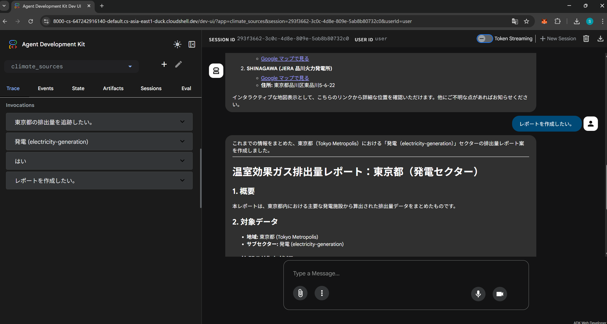
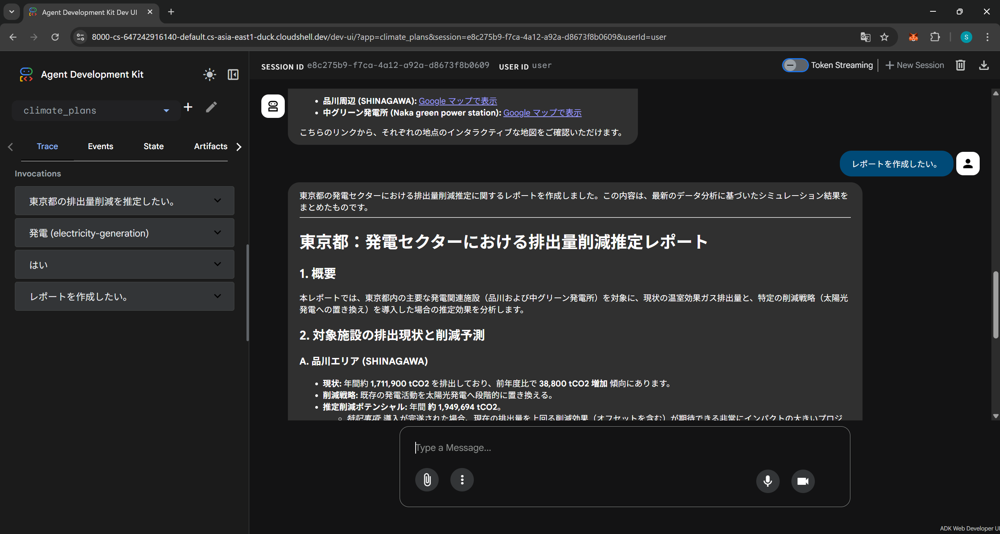
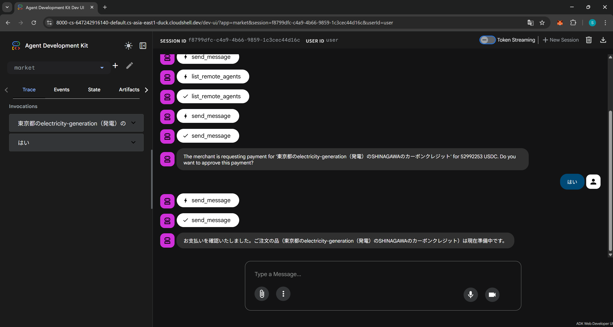

# Zero Assembly (ゼロ会)

## 概要

包括的な排出量の洞察
1.  **グローバルの排出量を追跡する:**　世界中の７億 4,500万の温室効果ガスと大気汚染物質の発生源から。現在は、日本中の4,700の温室効果ガスと大気汚染物質の発生源から。
2.  **排出量削減の推定:**　世界中のあらゆる発生源に対する具体的かつ可能な気候アクションから。現在は、日本中あらゆる発生源に対する具体的かつ可能な気候アクションから。
3.  **排出量削減の購入:**　世界中のあらゆる発生源に対する具体的かつ可能な気候資金から。現在は、日本中あらゆる発生源に対する具体的かつ可能な気候資金から。

### 利点　

*   世界の排出量を測定: [Climate TRACE](https://climatetrace.org/)を利用して、温室効果ガス排出量をこれまでにない詳細さとスピードで追跡するテクノロジーを活用することで、意義のある気候変動対策をより迅速かつ容易に実施できるようにします。世界の排出量ネットゼロ達成を目指すすべての関係者にとって有益な情報を提供します。
*   フットプリントの削減: Climate TRACEを利用して、排出量の追跡にとどまらず、管理下にあるあらゆる排出源に対して実行可能な **気候変動アクション**を実行することで、具体的な排出削減目標を達成する方法を示します。
*   世界の排出量の購入: Climate TRACEを利用して、排出量の追跡にとどまらず、管理下にあるあらゆる排出源に対して実行可能な **気候資金**を実行することで、具体的な排出削減目標を達成する方法を示します。

### 主な機能

オープンデータ。100 を超える大学、科学者、AI 専門家からなる世界的な非営利連合によって構築されました。
*  744,678,997 件の排出資産を個別に、または都市、州、国など別に集計して調べます。ゼロ会は、4,700件の排出アセットを個別に、都道府県別に集計して調べます。
*  10の産業セクターを67のサブセクターに分割したグループ排出量
*  10年以上にわたるデータ（2015～2025年）を追跡し、2021年からは月次データが利用可能。ゼロ会は、1年のデータ（2024年）を追跡。
*  3つの温室効果ガスの影響を見る。ゼロ会は、1つの温室効果ガスの影響を見る。

LLM。多言語性と事実性と推論により、世界中の誰もが正確な根拠に基づき論理的に気候変動を理解できる基盤を構築します。
*  多言語性: 英語主体の排出データをLLMが多言語化。世界中の誰もが自国語で環境データにアクセス可能にします。
*  事実性: 衛星観測による厳密な数値を根拠にLLMが回答。根拠を明示し、嘘のない正確な情報提供を実現します。
*  推論: 排出量の増減理由をLLMが論理的に分析。単なる数値から、背景にある原因や改善策の洞察を導きます。

## Deployment Guide

```bash
.
├── LICENSE
├── README.md
├── adk_agent
│   ├── climate_plans
│   ├── climate_sources
│   └── market
├── cleanup
│   └── cleanup_env.sh
├── data
│   ├── admins.csv
│   └── sources.csv
├── requirements.txt
├── server
│   ├── __init__.py
│   ├── __main__.py
│   └── agents
├── setup
│   ├── setup_bigquery.sh
│   ├── setup_csv.py
│   ├── setup_csv.sh
│   └── setup_env.sh
```
## ローカル
### 1. Authenticate with Google Cloud
```bash
gcloud config set project [YOUR-PROJECT-ID]
export PROJECT_ID=$(gcloud config get project)
gcloud auth application-default login
```
### 2. Clone the Repository
```bash
git clone https://github.com/shogoorg/za.git
cd za
```
```bash
git clone https://github.com/google-agentic-commerce/a2a-x402.git
```
### 3. Configure Environment
```bash
dos2unix setup/setup_env.sh
chmod +x setup/setup_env.sh
./setup/setup_env.sh
```
### 4. Provision BigQuery
```bash
dos2unix setup/setup_bigquery.sh
chmod +x setup/setup_bigquery.sh
./setup/setup_bigquery.sh
```
Could have
```bash
python3 setup/setup_csv.py
```
## 5. Deployment Guide
```bash
export GOOGLE_API_KEY="<Your API KEY>"
python3 -m venv .venv
source .venv/bin/activate
pip install -r requirements.txt
```
```bash
python -m server
python -m server --host 0.0.0.0
```
```bash
source .venv/bin/activate
cd adk_agent
adk web --port=8000
```
## GCP
### 1. Authenticate with Google Cloud
```bash
gcloud auth list
gcloud config get project
export PROJECT_ID=$(gcloud config get project)
```
```bash
gcloud auth application-default login
```
⚠️注: ADK は OAuth 2.0 トークンを自動的に更新しません。チャットセッションが 60 分以上続く場合は、上記のコマンドを使用して再認証が必要になる場合があります。

### 2. Clone the Repository
```bash
git clone https://github.com/shogoorg/za.git
cd za
```
```bash
git clone https://github.com/google-agentic-commerce/a2a-x402.git
```

### 3. Configure Environment
```bash
dos2unix setup/setup_env.sh
chmod +x setup/setup_env.sh
./setup/setup_env.sh
```
### 4. Provision BigQuery
```bash
dos2unix setup/setup_bigquery.sh
chmod +x setup/setup_bigquery.sh
./setup/setup_bigquery.sh
```
Could have
```bash
python3 setup/setup_csv.py
```
## 5. Deployment Guide
```bash
cd za
python3 -m venv .venv
source .venv/bin/activate
pip install -r requirements.txt
```
```bash
export GOOGLE_API_KEY="<Your API KEY>"
python -m server --host 0.0.0.0
```
新規ターミナル
```bash
cd za
source .venv/bin/activate
cd adk_agent
adk web --port=8000
```
### 6. Chat with the Agent (Sample Narrative: Emission Strategy)
排出量を追跡
climate_sourcesエージェントを選択
1. 東京都の排出量を追跡したい。
2. electricity-generation（発電）
3. （地図を表示しますか?）SHINAGAWAの地図を表示
4. レポートを作成したい。

　[排出量を追跡のセッション](https://gist.github.com/shogoorg/c521bcdab975ab5cba26017d2744de63)

排出量削減の推定
climate_plansエージェントを選択
1. 東京都の排出量を推定したい。
2. electricity-generation（発電）
3. （地図を表示しますか?）SHINAGAWAの地図を表示
4. レポートを作成したい。

　[排出量削減の推定のセッション](https://gist.github.com/shogoorg/3246a9127a38b61315632aad7b431020)

排出量削減の購入
marketを選択
1. 東京都のelectricity-generation（発電）のSHINAGAWAのカーボンクレジットを購入したい。
2. (この支払いを承認しますか?) はい

　[排出量削減の購入のセッション](https://gist.github.com/shogoorg/7eef27a8d1dc74bc04d002c1bab41ba5)

### 7. Cleanup
```bash
dos2unix cleanup/cleanup_env.sh
chmod +x cleanup/cleanup_env.sh
./cleanup/cleanup_env.sh
```
### Data Logic & Narratives
| Table | Demo Purpose |
| :--- | :--- | 
| **sources** |Climate TRACE によって監視されているすべてのサブセクターの排出源レベルの排出データを含むテーブル。 |
| **plans** | 世界のすべてのサブセクターの排出削減ソリューションを示すテーブル|